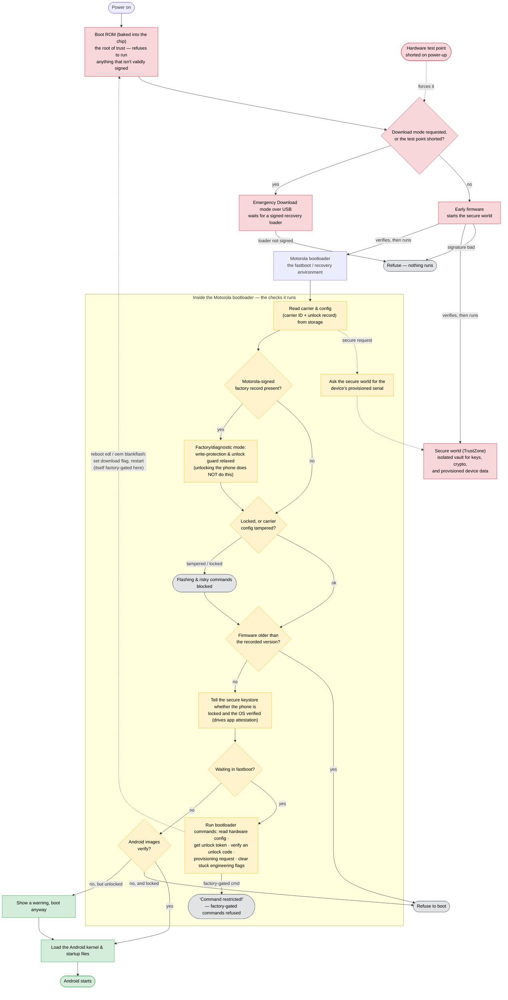
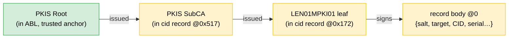
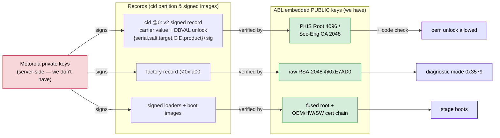

# Motorola devices: how recovery, secure boot, and CID provisioning work

This document explains what go-unbrick has learned about modern Qualcomm-based
Motorola phones. The goal is that after reading it you understand *why* a given
recovery step works, why some things are simply impossible, and what the tool is
doing under the hood — not just which command to type.

**Who this is for:** someone new to Motorola/Qualcomm recovery who is comfortable
with a terminal but hasn't internalized the boot chain, secure boot, or
Motorola's CID scheme yet. Every acronym is defined the first time it appears,
and there's a glossary at the end (§11) if you land in the middle.

**How to read it:** §1–§2 build the mental model (the two recovery interfaces,
and the secure-boot wall that shapes everything else). §3 is the deep dive on
CID — the most novel material here. §4–§6 are practical (reading a device,
failure states, commands). §7 is an FAQ for common "can I…" questions; §8–§11
are reference. If you only read two sections, read §1 and §2.

If you just want commands, see the README. This is the "why" behind them.

Everything below is grounded in live reverse-engineering of two secure-production
**fogona** units — the codename for the Motorola phone model we tested (XT2413,
Snapdragon SM6225, SoC id `001B80E1`). "Secure-production" means retail units
with secure boot fused on, i.e. exactly what a normal user has, not an
engineering sample.

---

## 1. The two ways in: fastboot vs EDL

When a phone is broken you need a low-level way to talk to it that doesn't depend
on Android booting. A Qualcomm-based Motorola gives you two, and knowing which
one you're in — and what each can do — is the foundation for everything else.

### Fastboot (bootloader mode)

The **AP** (application processor — the main CPU that normally runs Android) is
running Motorola's own bootloader, called **ABL** (Android Boot Loader) / **MBM**
(Motorola Boot Manager). You talk to it over USB with the `fastboot` tool.

- `fastboot getvar <name>` reads a state variable (serial number, lock state, …).
- `fastboot oem <cmd>` runs a Motorola-specific vendor command.

Fastboot is only available when the boot chain is intact enough to *reach* the
bootloader. If the phone is truly dead — corrupt or wiped bootloader — fastboot
is gone, and you need the second interface.

### EDL / 9008 (Emergency Download Mode)

**EDL** is Qualcomm's last-resort recovery mode. Here the SoC isn't running
Android or even Motorola's bootloader — it's running code baked into the chip
itself, the **BootROM** (also called **PBL**, Primary Boot Loader). Because that
code lives in read-only silicon, EDL works *even if every partition on the flash
storage is wiped or corrupt.* This is the true "unbrick" path. On USB the device
shows up with product id `9008`, which is why people call it "9008 mode."

EDL by itself can't do anything useful, though — the BootROM is deliberately
minimal. You have to hand it a small program to run. That program is the
**firehose loader** (also "programmer" or just "loader"): a signed binary that,
once running, can read and write the phone's flash partitions. Two protocols are
involved:

- **Sahara** — the handshake protocol the BootROM uses to *receive* the loader.
- **Firehose** — the protocol the loader itself speaks once it's running, to
  read/write partitions (in XML commands).

So the EDL recovery flow is: enter 9008 → send a firehose loader over Sahara →
the loader runs → issue Firehose read/write commands to repair partitions.
Motorola packages this loader plus the partition images as a **blankflash**.

In go-unbrick: `recon` reads a device through **fastboot**; the `edl` commands
drive the **EDL/blankflash** path.

The reason EDL matters is that it survives a wiped boot chain. But — and this is
the pivotal point that §2 is about — EDL is **not** a way around secure boot. You
can't just feed it any loader you like.

---

## 2. Secure boot: why you can't run an arbitrary loader

Here's the single most important fact for Motorola recovery: **the BootROM will
only run a firehose loader that is cryptographically signed for *this exact*
chip.** If you understand this, most of the "why can't I just…" questions answer
themselves.

### What the chip checks, and where the "answers" are stored

Modern SoCs contain **QFPROM** — Qualcomm's one-time-programmable fuses. During
manufacturing, certain values are permanently "burned" into these fuses: a hash
of the trusted root signing key, an OEM identifier, a chip-model identifier, and
so on. Fuses can be blown from 0→1 but never reset, so these values are fixed for
the life of the chip.

When the BootROM/PBL receives a loader over Sahara, *before* it jumps to it, it:

1. Parses the loader's attached **X.509 certificate chain** and its **RSA-2048**
   signature (the standard public-key crypto for "prove this was signed by a
   trusted key without shipping the private key").
2. Verifies that chain up to a root whose hash matches the one burned in QFPROM.
   A loader signed by anyone else fails here.
3. Checks the loader's *signed attributes* against the fuses:
   - **OEM_ID** — must match the OEM that owns the device (Motorola).
   - **HW_ID / JTAG_ID** — must match the SoC model (`001B80E1` on fogona).
   - **SW_ID** — an **anti-rollback** counter. Each time the fuse advances, older
     software signed with a lower SW_ID is permanently rejected, so you can't
     downgrade to a loader with a known bug.
4. Only if *all* of that matches does it execute the loader.

### What this means for you as a new user

- **You need a loader signed for the same SoC/OEM family as your device.** A
  loader harvested from a different chip won't authenticate — the fuse check
  fails. This is why go-unbrick puts so much effort into harvesting loaders and
  identifying which SoC each one is for. Matching that identity *is* the job.
- **You cannot patch the loader.** Want to remove a check, or add support for a
  partition it won't touch? Any edit — even one byte — invalidates the signature,
  and the BootROM rejects it before it ever runs. The loader is not a place you
  can inject your own behavior. Everything a loader can do for you is a capability
  its *legitimate signer* already built in.
- **Reflashing can't disable it.** Secure boot is enforced by the BootROM, which
  runs in silicon *before* any flash content is touched. Wiping or reflashing the
  phone therefore can't turn it off. Genuinely disabling it would require either
  unfused "engineering" silicon (chips where the fuses were never blown) or a
  BootROM/PBL exploit — neither of which is a normal recovery tool.

The "loader identity" that `recon` and the loader-inventory tooling report —
OEM_ID, HW_ID, SW_ID, certificate subject — is *exactly* the set of signed
attributes the BootROM checks in step 3. Matching them is how you know, before
you even plug in, that a given loader will run on a given device.

### The whole boot process, power-on to Android (Motorola)

Every solid arrow means the previous stage **checks the next one's Motorola
signature before running it** — that's the chain of trust. The Motorola bootloader
stage is where recovery happens and is what the rest of this document takes apart.



Red = the chip's boot ROM and the secure world; yellow = the Motorola bootloader,
where recovery lives; green = Android; grey = a check that **refuses** and stops
that path. **Getting into Emergency Download mode:** the boot ROM decides at
power-on based on a *download-mode flag* — which `reboot edl` / `oem blankflash`
set just before restarting the phone (usually **refused** on this model, behind a
factory gate) — or a *hardware test point* shorted on the pads, which forces it
with no software involved. Even there the chip won't run an unsigned loader. Notice
the refusals: a bad signature or a stale image dead-ends, a tampered carrier config
blocks flashing, and only a Motorola-signed record — never an unlock — opens
factory mode (§1–§3).

---

## 3. The CID partition and carrier provisioning

**CID** stands for "Customer ID" (Motorola also calls it the carrier/channel ID).
It's a small partition named `cid` that records which carrier and channel the
device is provisioned for. It drives carrier customization (branding, feature
flags), and — importantly — a **bad or tampered `cid` can lock the device out**
(see §5). Understanding it is the most novel part of what we reverse-engineered,
so this section goes deep.

### 3.1 Two on-disk formats

go-unbrick's `internal/cid` package recognizes two `cid` formats. They're told
apart by a 16-bit version number stored just after a fixed 2-byte magic
`0x00F0` at the start of the partition (at byte offset `0x02`).

**Version 0 — the unsigned template (44 bytes = `0x2c`).**
Header bytes `00 f0 00 00 00 00 00 2c`, which decode as: magic `00 f0` (offset
`0x00`), version `00 00` u16 BE (`0x02`), then a u32 BE length `00 00 00 2c`
(`0x04`) — i.e. the header states its own 44-byte length. The only meaningful
variable is a big-endian 16-bit **channel** value at offset `0x2a` (the last two
bytes). Nothing signs or hashes this format, so you can write whatever channel
you want directly.

This is the stock `cid_template.dat` form you see in flashfiles. The `cid50` vs
`cid51` naming refers to that channel value: `cid51` carries `0x33`, `cid50`
`0x32` (ASCII `'3'`/`'2'`). The tool builds this with `cid.Build(value)` and
reads it back with `cid.Parse`, which rejects any image whose length or header
doesn't match the template exactly.

Layout:

| Offset | Size | Field |
|-------:|-----:|-------|
| `0x00` | 2 | magic `00 f0` |
| `0x02` | 2 | version = `0x0000` (u16 BE) |
| `0x04` | 4 | length = `0x0000002c` (u32 BE) |
| `0x08` | 0x22 | zero/reserved template body |
| `0x2a` | 2 | **channel** (u16 BE) — the one variable |

**Version 2 — the signed structure (what retail devices actually have).**
Header `00 f0 00 02 00 00 00 70` — same magic, version `0x0002`, length `0x70`.
It carries the salt/chip-serial, SoC id, the CID value, the device id and serial,
and the product name, plus the DBVAL unlock `target` (a `0x70`-byte body) —
followed by an **RSA signature and an embedded X.509 certificate chain**, ~2.4 KB
in all (see the layout in §3.5). (This is the *same* record as the DBVAL unlock
record, §3.5 — carrier data and unlock data share one signed blob, confirmed on a
real dump.) That block is **not** something you can recompute (it isn't a plain hash of
the contents): it's minted by Motorola's after-sales **PKI** (their signing
servers) and is cryptographically bound to *this specific device.* This is what
actually lives on a retail fogona. `cid.IsSigned` returns true for it
(version ≥ 2), and that's your signal to *not* clobber it with a v0 template.

Use `cid.Version(img)` to read the version, and `cid.IsSigned(img)` to check for
v2. **Detect the version before you overwrite anything.** Writing a v0 image over
a device that shipped v2 is a *format downgrade* whose acceptance by ABL is
unverified — the bootloader might read it as a valid unsigned CID, or it might
reject it as tampered and drop into the lock-out state.

### 3.2 `fastboot oem cid_prov_req` — reading the provisioning request

Here's how Motorola provisions a CID at the factory / repair depot:

1. The device generates a **`cid_prov_req`** blob — a provisioning *request.*
2. It's sent to a Motorola after-sales **server**, which signs it and returns
   **`cid_prov_data`** (the signed CID payload).
3. The device writes that payload with an internal command, `ssm_flash_cid`.

You can ask the device for step 1's request directly: `fastboot oem cid_prov_req`.
`recon` issues this (with a 3-second timeout) and decodes the ~196-byte structure
it returns (the parser lives in `internal/fastboot`). The device answers in one
of two shapes, and the parser handles both:

- **Hex blocks** — the usual case. Motorola prints the binary as
  `(bootloader) <hex bytes>` lines. The parser concatenates every hex line back
  into one byte slice (`Raw`) and decodes by offset (below).
- **Key/value** — some ABL builds answer `(bootloader) key: value` instead;
  those land in a `Fields` map. Every raw device line is also kept in `RawLines`
  for `--raw`.

Decoded fields (from the hex form):

| Offset | Size | Field | Notes |
|-------:|-----:|-------|-------|
| `0x00` | 2 | Format version (u16 BE) | `3` on fogona |
| `0x42` | 16 | **digest** | device-unique secret; see §3.3 |
| `0x54` | 2 | `00 F0` marker | sanity-gate: decode only proceeds if these two bytes are `00 f0` |
| `0x60` | 4 | SoC id | `001B80E1` on fogona |

The decode is deliberately defensive: it reads the format version unconditionally
(first two bytes), but only trusts the SoC id and digest offsets when the `00 f0`
marker is present at `0x54` — otherwise it leaves them empty rather than
reporting garbage. Each field access is also length-guarded, so a short or
truncated reply degrades gracefully instead of panicking.

In effect, `cid_prov_req` is a masked copy of the live v2 `cid` plus that digest —
it's the request the device *would* send to obtain a fresh signed CID.

### 3.3 The digest is a per-boot session value

The 16-byte digest at offset `0x42` is a **per-boot session value**: regenerated
each boot, constant within a boot. On one unit (`ZLTEST0001`), three back-to-back
`cid_prov_req` calls return an identical value, but that value differs after a
reboot — while the device UID at `0x5c` stays the same across boots.

So `cid_prov_req` is `[stable device UID @0x5c/0x60] + [per-boot session value
@0x42]`, where the session value binds the request to *this boot* — a nonce for
anti-replay in the after-sales provisioning handshake. It is **not** a device
identifier or a hardware secret: no hash of any visible field (chip serial, UID,
SoC id, serial, IMEI, CID, record slices — keyed or unkeyed) reproduces it,
because there is no stable input, and there is nothing to reproduce offline.

In the ABL, `cid_prov_req[0x42]` is written by a SHA-1 KDF
(`cmd_cid_prov_req → FUN_0004c200 → FUN_0005bab0 → FUN_0004ca70 → FUN_0004d6c0`).
Its seed is **uninitialized stack**: `FUN_0004d760` is supposed to initialize the
20-byte KDF state via `FUN_0004e240`, but that function is an inert stub (empty
`ret`), so the key ends up as `SHA1(leftover stack)`. Leftover stack is
deterministic within a boot (same value every call) but differs across boots —
which is exactly the observed per-boot behaviour. It's effectively an accidental
nonce from uninitialized memory, not a derived secret. (`DAT_000d8144` in the
transform is the SHA-1 IV, not a key.) The RSA/secure-boot walls (§3.5, §2) — not
this digest — are what protect provisioning and unlock.

For sharing a report safely, `recon --redact` masks the digest along with other
per-device identifiers (serial, UID, chip id, IMEI, part numbers). Redaction is
**opt-in**, not the default, because `recon` is a local diagnostic tool and you
usually *want* the real values in front of you.

> **Safety note:** **never read the QFPROM fuses raw on a live device** (e.g. via
> `/sys/bus/nvmem/.../qfprom0/nvmem`) — it faults the SoC and instantly reboots the
> phone. Avoid raw fuse/RPMB/bsg reads while probing generally. (For the HUK/RPMB
> access model — why only TrustZone can reach them — see [OP-TEE secure storage](https://optee.readthedocs.io/en/latest/architecture/secure_storage.html)
> and [Exploiting RPMB authentication in a closed-source TEE](https://eprint.iacr.org/2024/180.pdf).)

### 3.4 Why you cannot raw-write a signed CID

On the tested fogona units, writing a `cid` image over Firehose (i.e. through the
EDL loader) is **acknowledged but silently discarded** — the loader says "OK" but
the partition doesn't actually change. There are effectively three independent
walls between you and a forged CID:

1. **BootROM loader verification (§2)** — you can't run a loader that would
   bypass Motorola's write rules in the first place.
2. **Restricted partition access** — the "lite" loader you get through
   Sahara/Firehose doesn't persist writes to `cid`; it drops them.
3. **PKI-signed, device-bound content** — even a persisted v2 CID has to carry a
   signature the device's own chain validates, and only Motorola's private key
   can mint a valid one *for this specific device* (the `cid_prov_req` digest is
   what binds it to the device).

So there is **no offline way to forge a valid signed CID.** Because of wall #2,
`edl setcid` now **reads the partition back after writing** and fails loudly if
the readback doesn't match what it wrote — no more false "success" reports when
the write silently bounced.

### 3.5 The `cid` partition also holds the bootloader-unlock record (DBVAL/DBVC)

The `cid` partition isn't only carrier data. Reverse-engineering
`MotoBootModule.efi` (the fogona ABL) — and confirmed by dumping a real `cid`
partition — shows it holds **two** records, which is why a corrupt or rewritten
`cid` (the `0xDEAD` state, §5) can break far more than carrier branding:

1. the **signed carrier + unlock record** at offset 0 — one v2 signed structure
   that is *both* the carrier/channel value (§3.1) *and* the DBVAL/DBVC unlock
   record (below). These are not two separate records: the same blob binds
   `{serial, salt, target, CID, product}` under one Motorola RSA signature;
2. a **factory-diagnostic authorization record** at offset `0xfa00` — gates
   Motorola's engineering/factory mode (§3.6).

This was verified against a real dump (device 1, `ZLTEST0001`): the record at
offset 0 is `00f0 0002` (v2), with the salt at `0x08`, id at `0x30`, serial at
`0x38`, and target at `0x50` — byte-for-byte the same `{salt, target, id, serial}`
that the device's `get_unlock_data` challenge reports, and the device's real
unlock code verifies against it. This section covers the unlock aspect of that
record; §3.6 covers the separate factory record.

**The record's real layout** (from device 1's dump — the `cid` partition is
131072 bytes / 128 KiB, almost entirely zero):

| Offset | Size | Contents |
|-------:|-----:|----------|
| `0x00000` | 8 | header — magic `00f0`, version `0002`, body length `0x70` |
| `0x00008` | 16 | salt (serial-derived nonce, `00c0ffee 001b80e1 …`) |
| `0x0002a` | ~38 | body — CID value, id `0123456789abcdef`, serial `ZLTEST0001`, product `moto g` |
| `0x00050` | 32 | `target` — the DBVAL unlock check compares `H(salt‖H(code))` to this |
| `0x00070` | ~258 | RSA signature over the body (by the leaf key) |
| `0x00172` | 931 | **leaf cert** `CN=LEN01MPKI01` (issued by `PKIS SubCA`) |
| `0x00517` | 1200 | **CA cert** `CN=PKIS SubCA` (issued by `PKIS Root`) |
| `0x009c7` | ~125 KiB | zero — unused, including the `0x0fa00` factory-record slot (empty → factory mode off, §3.6) |

So the record **carries its own certificate chain**, which is how the device
verifies it without a network: the embedded leaf + SubCA chain up to the
`CN=PKIS Root` that's baked into the ABL (§3.7). The signature over the body is by
the leaf; the leaf is vouched for by the SubCA; the SubCA by the fused-in Root.



Only Motorola's PKI can produce a leaf that chains to `PKIS Root`, so the whole
record is unforgeable even though it (and its verifying chain) is fully readable.

Two *independent* trust chains run on the device, and it's important not to
conflate them:

| Chain | Gates | Signature | Key |
|-------|-------|-----------|-----|
| **AVB** (libavb) | *booting* — verifies `vbmeta`/boot images every boot | RSA PKCS#1 v1.5 / SHA-256 | release-keys pubkey in firmware; root hash fused |
| **DBVAL / DBVC** | *unlocking* — authorizes `oem unlock` | RSA PKCS#1 v1.5 / SHA-256 | Motorola pubkey in firmware; **private key server-side only** |

**The unlock record.** A versioned, RSA-signed structure read from `cid` (2-byte
big-endian version at offset 0; v1 = SHA-1 era, v2 = SHA-256 era). The whole
record is signed by Motorola's private key, which is the *only* thing binding
`{serial, salt, target}` to Motorola — the device holds just the public key, so
it can verify but never mint one.

**The unlock-code check has no secret key.** This is the surprising part. When
you run `fastboot oem unlock <code>`, the bootloader does *not* compare your code
to a stored constant, and it's *not* an HMAC. It computes:

```
d1     = H(code_ascii[:20])       # first 20 chars of the code
d2     = H(salt(16) || d1)        # salt comes from the signed record
accept = (d2 == target)           # target is embedded in the signed record
```

Because the hash is unkeyed, the *forward* direction is free — pick any code,
compute its `target`. That's useless on its own, though: to get the device to
accept your self-chosen `{salt, target}` you'd have to defeat the **RSA
signature** over the record, and only Motorola can produce that. So the security
rests on exactly two things:

1. **RSA signature** over the record — an attacker can't mint one (the embedded
   verify keys are RSA-4096 and RSA-2048, both `e=65537`, so classic
   `e=3`/Bleichenbacher forgery doesn't apply).
2. **Hash preimage resistance** — given a legitimate signed `target`, recovering
   the matching code is a full SHA-256 preimage.

go-unbrick reimplements this check (ported byte-for-byte from the ABL-notes
`unlock_code_verify.py`), exposed as `unbrick unlock verify`. It validates a real
Motorola-issued code against a device's `get_unlock_data` challenge or a raw
record — but it cannot *derive* a code, for the two reasons above. The contracts
are vendor-neutral (`internal/unlock`: a plain `Record` carrying a verify closure,
plus a `SaltedDoubleHash` helper). A vendor implements a *single* interface —
`vendor.UnlockVerifier`, one method that parses its record — behind the existing
`vendor.Driver` seam; the returned `Record` holds its own check. So another OEM,
even one whose code check isn't a hash at all, is a new driver capability, not a
change to the core.

```
$ unbrick unlock verify '<id>#<serial>#<target>#<salt>' <CODE>
ACCEPT            # exit 0; REJECT + exit 1 on a bad code
$ unbrick unlock show --file cid.bin     # parsed version/serial/salt/target
```

**The one real weakness is physical, not software.** The entire authorization —
both the RSA check and the serial/nonce binding — is gated by a *single*
conditional branch taken right after the signature-verify routine returns. A
**fault-injection glitch** that skips that one branch makes the device accept an
attacker-supplied record with a self-chosen salt and target, unlocking with any
code. That requires hardware glitching equipment and physical access; it is not a
software bypass, and nothing in go-unbrick does it. (The serial/nonce binding
that would otherwise add replay resistance was also found to *fail open* to a
constant when the provisioned-serial read fails — so RSA, not the nonce, is the
real backstop. Documented for completeness; not actionable without the glitch.)

**Takeaway for a user:** an unlock-eligible device unlocks the normal way
(`get_unlock_data` → Motorola's site → code). An ineligible one is protected by
RSA you can't forge, so there is no code, file, or flash operation that unlocks
it — see the FAQ (§7).

### 3.6 The `cid` partition also gates factory/diagnostic mode

The ABL's factory/engineering "diagnostic mode" (`_gDiagnosticMagic = 0x3579`) —
which bypasses the OEM-unlock guard, partition write protections, and identifier
redaction — is authorized by a **second record in the `cid` partition**, at offset
`0xfa00`. The ABL (`FUN_0001b940`) reads a 400-byte record there and gates on it:
a big-endian u16 content-length field (`buf[2..3]`, `< 400`, with the remainder to
400 zero-padded), a magic field `0xEE11FF22`, and then an RSA signature check.

That signature is verified with a **separate embedded root key** from the unlock
chain: a raw RSA-2048 key at offset `0xE7AD0` in `MotoBootModule.efi` (exponent
65537 at `0xE7BD0`), PKCS#1 v1.5 / SHA-256. Only a record signed by Motorola's
private key flips the mode; a device without secure boot fused, or a signed OEM
boot parameter, are the only other routes. This is the mechanism behind the
"factory gate" that refuses `oem partition md5`/`moto-dump` etc. (§5, §2) — it is
**not** the OEM lock, and unlocking the bootloader does not lift it.

You can't forge this record for the same reason you can't forge a signed CID or a
DBVAL unlock: the device holds only the public key. go-unbrick's `internal/rsakey`
extracts this root key (and the embedded cert roots) from an ABL image; the
`library keys` review matches such keys across models.

### 3.7 The whole key/cert chain: what we have and what we don't

Every trust boundary on the device is the same shape: **Motorola holds a private
key, the device ships only the matching public key**, and each check verifies a
signature the device can validate but never mint. We have extracted every *public*
half; we have none of the *private* halves, and none of the per-device hardware
secrets. That asymmetry is the whole security model — and the reason nothing here
is a bypass.



Green = public value we hold; red = the Motorola private keys we don't. Every
arrow from red to green is a signature the device can *verify* but never *mint*.

| Public key / cert | Where it lives | Type | Verifies | Have the public value? | Private key |
|-------------------|----------------|------|----------|------------------------|-------------|
| Qualcomm/OEM boot root | QFPROM fuses (hash) | fused hash | the whole boot chain (PBL → xbl → abl…) | no — a fused hash, not extracted | Qualcomm/Motorola |
| Boot-chain cert chain (OEM_ID/HW_ID/SW_ID) | signed loaders & boot images | X.509 RSA | the firehose loader and each boot stage | **yes** — `internal/secboot` parses it | Motorola/Qualcomm |
| Factory-diagnostic root | ABL raw key @`0xE7AD0` | RSA-2048 | the `cid`@`0xfa00` factory record (§3.6) | **yes** — modulus SHA-256 `199d452f…` | Motorola |
| `CN=PKIS Root` | ABL cert @`0xd78f8` | RSA-4096 | DBVAL unlock record | **yes** | Motorola |
| `CN=Motorola Security Engineering Root CA` | ABL cert @`0xd7e36` | RSA-2048 | DBVAL unlock record | **yes** | Motorola |
| `CN=Server Root, OU=Factory` | ABL cert @`0xd8218` | RSA-4096 | *role unconfirmed* (a factory-server CA?) | **yes** | Motorola |
| CID provisioning / unlock signer | Motorola after-sales PKI | RSA | the unified `cid`@0 record — the `cid_prov_data` **is** the DBVAL record, verified by the unlock roots above | signature block opaque; on a real dump the record is signed once, so likely the same key as the DBVAL roots | Motorola |
| `cid_prov_req` digest @0x42 | — (per-boot session value) | SHA-1 KDF over a per-boot seed | binds a provisioning request to *this boot* (anti-replay); not a key (§3.3) | yes — it's in the `cid_prov_req` output | n/a — ephemeral, not a secret |

(The two ABL certs that verify DBVAL match, by exact byte length, CRYPTO.md's
"primary" RSA-4096 and "fallback" RSA-2048 unlock-verify keys — so `PKIS Root` and
the `Security Engineering Root CA` are the unlock roots; which is primary vs
fallback is inferred from length, not pinned.)

**The data flows, all the same pattern:**

- **Bootloader unlock:** device emits `get_unlock_data` (`id # serial # target #
  salt`) → Motorola's server signs a DBVAL record with its private key → device
  verifies with the embedded unlock root → your code passes only if
  `H(salt‖H(code)) == target` (§3.5).
- **CID provisioning:** device emits `cid_prov_req` (SoC id + device digest +
  masked `cid`) → after-sales server mints `cid_prov_data` — which *is* the v2
  signed `cid`@0 record (carrier value + the DBVAL unlock fields, one signature) →
  device writes and verifies it (§3.2, §3.5).
- **Factory/diagnostic mode:** a 400-byte record signed by Motorola is placed in
  `cid`@`0xfa00` → ABL verifies it against the `0xE7AD0` root → sets `0x3579`
  (§3.6).
- **Boot:** Qualcomm PBL verifies each stage against the fused root and the signed
  cert chain's OEM/HW/SW ids (§2).

**What we do not have (and cannot get offline):**

- Every **Motorola private key** above — the boot-chain signer, the factory-
  diagnostic root, the unlock roots (`PKIS Root`, `Security Engineering Root CA`),
  the factory-server root, and the CID-provisioning signer. All are server-side.

(The `cid_prov_req` digest is *not* in this list — it's a per-boot session value,
not a key; §3.3.)

With only the public halves, you can *verify* a Motorola-issued signature and
*read* every record, but you cannot forge one, derive a code, or lift the factory
gate. The `cid`@0 record is one signed blob the DBVAL unlock path verifies, so the
carrier value and unlock record share a signature.

---

## 4. `recon`: what it tells you and how to read it

`recon` (over fastboot) collects everything the bootloader is willing to
disclose:

- **Identity** — serial, UID, chip id, IMEI, part numbers.
- **Boot-chain versions** — every signed component's version string: `xbl`
  (eXtensible BootLoader), `abl`, `tz` (TrustZone — the secure-world OS), `hyp`
  (hypervisor), `keymaster` (the key-management trustlet), and more. Useful for
  spotting mismatched or downgraded firmware.
- **Lock / secure state.**
- **Carrier / CID state**, including the decoded `cid_prov_req` (§3.2).

Useful flags:

- `--raw` — dump *every* `getvar` variable plus the raw `cid_prov_req` hex, for
  when you need a byte that isn't in the summary.
- `--redact` — mask per-device identifiers (serial, UID, chip id, IMEI, part
  numbers, and the CID digest) so the report is safe to paste into an issue or
  chat. Combined with `--raw`, the raw hex dump also blanks the digest and
  chip-serial byte ranges inside the cid structure.

The report specifically flags a CarrierID of **`0xDEAD`** — which brings us to…

---

## 5. The `0xDEAD` carrier state

`0xDEAD` in the carrier/CID field is Motorola's sentinel for **"the CID is
missing or tampered."** A device in this state typically **blocks AP fastboot**
and refuses to boot normally — it's a common failure *after* a botched CID write
or a corrupted `cid` partition.

Getting out of it means restoring a *valid* CID. On a secure-production device
that means restoring the **signed v2** blob — you can't just write a v0 template
and expect ABL to accept it (§3.1). This is precisely why go-unbrick refuses to
pretend a non-persisting `cid` write succeeded: a tool that lied here would leave
you thinking you'd fixed a `0xDEAD` brick when you hadn't.

---

## 6. Command map

### 6.1 go-unbrick commands

| You want to… | Command |
|--------------|---------|
| Read full device identity + CID state (fastboot) | `fastboot recon` |
| …with every raw var and the cid hex | `fastboot recon --raw` |
| …masked for sharing | `fastboot recon --redact` |
| Read the `cid` partition (EDL) | `edl readcid` |
| Write a `cid` (EDL, read-back verified) | `edl setcid` |
| Verify a bootloader-unlock code offline | `unlock verify <wire> <code>` / `--file cid.bin` |
| Show a parsed unlock record | `unlock show <wire>` / `--file cid.bin` |
| Blankflash a dead device (EDL) | `edl` blankflash flow (see README) |

### 6.2 Device fastboot & OEM commands

What the *bootloader itself* answers, and what it takes to run each one. Three
access tiers, from the ABL gate logic (§2, §5):

- **any** — works even locked (reads only).
- **unlocked** — needs the bootloader unlocked (`flashing unlock`, state `0x7070`).
- **factory** — needs a Motorola-signed factory/diagnostic record or a production
  cable; an *unlock does not grant it* (§3.6). Refused otherwise.

**Standard fastboot**

| Command | Does | Tier |
|---|---|---|
| `getvar <var>` / `getvar all` | Read a bootloader variable (product, slot, lock state, partition sizes) | any |
| `flash <part> ` | Write an image to a partition | unlocked |
| `erase <part>` / `format <part>` | Wipe / re-format a partition | unlocked |
| `boot ` | Download and boot a kernel without flashing | unlocked |
| `flashing unlock` / `lock` | Toggle the OEM-unlock state (consumes the unlock allowance) | user-consent |
| `reboot` / `reboot-bootloader` | Normal reboot / back into fastboot | any |
| `reboot edl` | Set the download-mode flag and restart into 9008 — **factory-gated here** (§1, diagram §2) | factory |

**Motorola `oem` commands**

| Command | Does | Tier |
|---|---|---|
| `oem get_unlock_data` | Export the unlock challenge (`id # serial+model # target # salt`) from the `cid` record (§3.5) | any |
| `oem unlock <code>` | Validate a 20-char code against the RSA-signed `cid` record, then unlock | any (record-gated) |
| `oem cid_prov_req` | Emit the provisioning request — per-boot nonce + persistent UID (§3.2) | any |
| `oem read_sv` | Read anti-rollback / security-version counters | any |
| `oem hw` | Dump hardware config / UTAG variant info | any |
| `oem device-info` | Report lock, secure-boot, and tamper flags | any |
| `oem config <name>` | Read a UTAG | any |
| `oem config <name> <value>` | Write a UTAG — locked devices allow only a whitelist (`bootmode`, `carrier`, `cmdl`, `fsg-id`, `battery`, …); others → `Not allowed command` | unlocked / whitelist |
| `oem partition` | List the partition table | any |
| `oem partition moto-dump <name>` | Read a partition off the device | factory |
| `oem partition md5/sha256 <name>` | Hash a partition | factory |
| `oem partition erase <name> [off size]` | Block-aligned raw erase within GPT bounds | factory |
| `oem partition dump <name>` | Deprecated stub → `Latest Motorola fastboot required` | (retired) |
| `oem ssm <flag>` | Set persistent SSM flags (`disable-verity`, `adb_early_on`, `enable-thinkshield`, …) | unlocked |
| `oem ramdump` | Arm RAM-dump collection | factory / CID 0 / DTB flag |
| `oem blankflash` | Request the EDL blankflash path — emits a hardcoded `Latest Motorola fastboot required` INFO and refuses here | factory |
| `oem virtualab …` · `oem test_points` · `oem ssm_test wp` | Engineering-only | dispatcher-blocked → `command restricted` |

Three distinct refusals tell you *where* the block happened: lowercase
`command restricted` = the dispatcher rejected the whole command (engineering-only);
`Command restricted!` (capital, `!`) = the handler ran but the subcommand self-gated
(e.g. `oem partition md5`); `restricted` = the `ramdump` handler's own check.
`Latest Motorola fastboot required` is **not** a gate verdict — it's a hardcoded
string retired handlers emit unconditionally (`oem partition dump`'s stub, and the
`oem blankflash` INFO packet), so it says nothing about lock or factory state. On
fogona the factory tier is closed on both locked **and** unlocked units, so
`blankflash`/`edl` over fastboot are dead ends — EDL entry is the test point (§1).

---

## 7. FAQ (the things new users actually search for)

Short, honest answers. Most of these are "no," and §2 explains why the "no" is a
property of the silicon, not a limitation of this tool. Read the linked sections
for the full reasoning.

**Can I reset / change my CID to another carrier?**
Not on a normal retail device. The live `cid` is a **version-2 signed** structure
bound to your specific phone by Motorola's PKI (§3.1), and firehose writes to it
don't persist (§3.4). You can *build* an unsigned v0 template with a chosen
channel, but writing it over a v2 device either bounces (the loader discards it)
or risks the `0xDEAD` lock-out (§5). There is no offline way to mint a valid
signed CID for a carrier you weren't provisioned for. `edl setcid` will tell you
honestly if the write didn't stick (it reads back and compares).

**Can I bypass a carrier / network (SIM) lock?**
No — and note this is a *different* lock from the CID. A network/SIM lock is
enforced by signed modem/carrier policy, unlocked only by an operator-issued code
or the carrier's own unlock process. Nothing in the EDL/CID path touches it, and
there's no signed loader that will remove it for you (§2). The legitimate route
is to request an unlock from the carrier once you're eligible.

**Can I force the bootloader to unlock without the code?**
No. We reverse-engineered exactly how `oem unlock` is checked (§3.5). The
authorization is an **RSA-signed record** (DBVAL) stored in the `cid` partition;
your code is accepted only if `H(salt‖H(code))` equals a target *inside that
signed record*. The code check itself has no secret — but you can't supply your
own salt/target without Motorola's RSA signature, and you can't derive the code
from a legitimate record without a full SHA-256 preimage. So: an eligible device
unlocks via `get_unlock_data` → Motorola's site → code; an ineligible one has no
software bypass. The *only* known break is a hardware fault-injection glitch that
skips a single verify branch — physical, equipment-dependent, and not something
this tool does. Editing or reflashing `cid` doesn't help: a self-made record
fails the RSA check.

**If I'm in EDL/9008, doesn't that mean I have full low-level control?**
No — this is the most common misconception. EDL only lets you hand the chip a
loader *it will verify and may reject* (§2). You get exactly the capabilities the
signed loader grants, nothing more. EDL is a recovery interface, not a jailbreak.

**Can I remove FRP (Factory Reset Protection) / a Google account lock this way?**
No. FRP is Android/Google account state, unrelated to CID or the boot chain, and
outside what this tool does. The intended path is signing in with the account
that was on the device.

**Can I downgrade to older firmware to exploit an old bug?**
Anti-rollback (the **SW_ID** fuse, §2) permanently blocks running signed images
older than the fuse level. Once a device has advanced, the old signed loaders and
boot images it would need are rejected by the BootROM.

**Then what *can* I do with go-unbrick on a Motorola?**
Recover a soft-bricked or wiped device by blankflashing the **correct signed**
images for your exact SoC (§1, §9), inspect device state and CID provisioning
with `recon` (§4), read/verify-write the `cid` partition through EDL (§6), and
share a safely-redacted diagnostic report (`--redact`, §3.3). In short: restore
what's legitimately yours to restore — it won't manufacture signatures the
hardware demands.

**Is any of this a way around secure boot?**
No. If a step here worked, it's because you supplied a properly *signed* piece
that the device already trusts. Genuinely defeating secure boot would need
unfused engineering silicon or a BootROM/PBL exploit — neither is part of normal
recovery, and neither is what this tool does.

---

## 8. What's settled, and what's still open

**Settled:**

- The firehose loader is verified by the BootROM against fused OEM/HW/SW ids and
  a fused root-key hash; it cannot be patched or substituted across SoCs.
- The retail `cid` is a version-2 signed, device-bound structure, not the
  44-byte unsigned template.
- The `cid_prov_req` digest (`0x42`) is a per-boot nonce, not a secret —
  `SHA1(uninitialized stack)` (an inert initializer stub), boot-stable and
  reboot-varying (§3.3). The persistent per-device id is the UID at `0x5c`.
- Raw Firehose writes to `cid` don't persist on secure-production units;
  `setcid` verifies by reading back.
- The `cid` partition holds two records (confirmed on a real dump): one v2 signed
  blob at offset 0 that is *both* the carrier value and the RSA-signed **DBVAL**
  bootloader-unlock record, and a **factory-diagnostic authorization record** at
  `0xfa00` (§3.5, §3.6). `oem unlock` verifies your code as `H(salt‖H(code))`
  against the `target` in that blob — no secret in the code check, security is the
  RSA signature (can't forge) plus SHA-256 preimage resistance; the only pure break
  is a fault-injection glitch on the single post-verify branch. The device's real
  code was verified against the on-device record end to end.
- The factory/diagnostic mode (`0x3579`) is gated by that `0xfa00` record, RSA-2048
  PKCS#1 v1.5 / SHA-256 verified against a *separate* embedded root key at `0xE7AD0`
  — distinct from the DBVAL/unlock keys, and not liftable by unlocking (§3.6).

**Open (minor):**

- The exact role of the `CN=Server Root, OU=Factory` cert embedded in the ABL, and
  which of the two DBVAL certs is the primary vs fallback verifier (inferred by
  length, §3.7).

**Hard safety rule:** never read QFPROM raw on a live device (§3.3), and avoid
fuse/RPMB/bsg raw reads while probing — they can fault or reboot the phone.

---

## 9. The mental model in three sentences

The chip will only run code Motorola signed for *this* chip, so you can't cheat
your way past the bootloader — you can only supply the *right* signed pieces.
CID is a signed, device-bound carrier record; the retail one can't be forged
offline, and a broken one (`0xDEAD`) locks the phone. go-unbrick's job is to read
what the device honestly exposes, match the correct signed loader to it, and
never pretend a write worked when the hardware quietly refused it.

---

## 10. Appendix: EDL / blankflash internals

A bit more detail on the EDL path from §1, for when you're staring at a
blankflash package and want to know what the pieces are.

### The Sahara → Firehose sequence

1. The device enters EDL and enumerates as USB `05c6:9008`.
2. **Sahara** runs first. The BootROM announces its version and which image it
   wants; the host replies with the firehose **loader** (often named
   `programmer.elf` / `prog_firehose_*.elf`). The BootROM verifies its signature
   against the fuses (§2) and, on success, jumps to it.
3. The now-running loader speaks **Firehose**: XML `<configure>` to negotiate the
   transfer size and storage type (UFS vs eMMC), then `<program>` / `<read>` /
   `<erase>` commands, each followed by the raw partition bytes over the bulk
   endpoint. `rawprogram*.xml` + `patch*.xml` describe what to write where.

The loader is the trust boundary: everything past it is only as capable as the
signed loader allows (see the "lite loader" note in §3.4).

### Motorola's `bootloader.img`: the SINGLE_N_LONELY container

Motorola bundles its boot-chain images in a single-file container whose magic is
the ASCII string **`SINGLE_N_LONELY`**. go-unbrick's `internal/blankflash`
(`singleimage.go`) packs and unpacks it. The format is a sequence of named
records; the one subtlety is inter-record **padding**, which the tool treats as
round-up to `0x1000` (4096) bytes. That alignment is corroborated by two
independent prior-art reimplementations (HemanthJabalpuri's `star.sh` and its
Python port `unpack-moto-img.py`); a third (an ImHex template) is
alignment-agnostic but compatible. Round-trip tests confirm `0x1000` for the
current device corpus. `FromBootloaderImg` is the code path that unpacks a
Motorola `bootloader.img` — the upstream `extractor.sh` firmware tool does *not*
handle this container, so the repo carries its own unpacker.

### QCDT device-tree model stripping (older devices)

Some Motorola boot images carry a **QCDT** (Qualcomm Device Tree) table that
selects a DTB by matching board/model identifiers. To reuse a donor image across
close-sibling models, `internal/qcdt` (`StripModel`, exposed as `--strip-model`
on `forge`/`derive`) removes the 32-byte `model` field from each extended-v3
QCDT entry (shrinking entries 72→40 bytes, zero-filled so DTB offsets stay
valid) and clears the `extended` flag, forcing selection to fall back to the
numeric ids. LZ4-framed input is decompressed first. This is validated by unit
tests and end-to-end through `forge`, but not yet against a real sibling `dt.img`
on hardware — current Motorola blankflashes don't ship a separate QCDT, so it
awaits an older-generation donor (e.g. an MSM8953-class device) to prove on
metal.

---

## 11. Glossary

- **AP** — Application Processor; the main CPU that runs Android.
- **ABL / MBM** — Android Boot Loader / Motorola Boot Manager; Motorola's
  bootloader, what fastboot talks to.
- **anti-rollback** — refusing to run older, lower-versioned signed software so
  known bugs can't be re-introduced; enforced via the SW_ID fuse.
- **AVB** — Android Verified Boot; the chain that verifies `vbmeta`/boot images
  at every boot. Separate from DBVAL (which gates *unlocking*, not booting).
- **blankflash** — Motorola's EDL recovery package: a firehose loader plus the
  partition images needed to revive a dead device.
- **DBVAL / DBVC** — the RSA-signed bootloader-unlock record stored in the `cid`
  partition; what `fastboot oem unlock` validates your code against (§3.5).
- **BootROM / PBL** — Primary Boot Loader; immutable code in the SoC that runs
  first and enforces secure boot.
- **CID** — Customer/Carrier ID; the `cid` partition recording carrier/channel
  provisioning.
- **EDL / 9008** — Emergency Download Mode; the BootROM-level recovery interface
  (USB product id `9008`).
- **fastboot** — the bootloader-mode protocol/tool for reading state and flashing.
- **Firehose** — the protocol a running loader speaks to read/write partitions.
- **fuses / QFPROM** — Qualcomm's one-time-programmable memory holding per-chip
  secure-boot values (root-key hash, OEM_ID, HW_ID, SW_ID).
- **HUK** — Hardware Unique Key; a per-chip secret used to derive device-bound
  keys.
- **loader / programmer** — the signed firehose binary EDL runs to access flash.
- **OEM_ID / HW_ID (JTAG_ID) / SW_ID** — fused identifiers the BootROM matches
  against a loader's signed attributes (owner / chip model / software version).
- **PKI** — Public Key Infrastructure; Motorola's signing servers that mint
  signed CIDs and loaders.
- **RPMB** — Replay Protected Memory Block; an authenticated secure region of the
  flash storage, keyed by a secret.
- **Sahara** — the protocol the BootROM uses to receive a loader in EDL.
- **SoC** — System on Chip; here the Qualcomm Snapdragon (SM6225 on fogona).
- **TrustZone (TZ)** — the ARM secure world / its OS, running trusted apps like
  keymaster.
- **XBL** — eXtensible BootLoader; an early Qualcomm boot-chain stage.

---

## 12. References

Background on the Qualcomm/Android hardware-security primitives this document
leans on (secure boot, HUK, RPMB, TrustZone):

- [LineageOS — Qualcomm's Chain of Trust](https://lineageos.org/engineering/Qualcomm-Firmware/) — QFPROM fuses, root-of-trust, the boot-chain stages.
- [Qualcomm — TrustZone & secure application](https://docs.qualcomm.com/doc/80-88500-4/topic/77_TrustZone_and_secure_application.html) — the TEE's QFPROM/HUK access.
- [Qualcomm — Secure Boot and Image Authentication (PDF)](https://www.qualcomm.com/content/dam/qcomm-martech/dm-assets/documents/secure-boot-and-image-authentication-version_final.pdf) — OEM_ID/HW_ID/SW_ID and the cert-chain verification the PBL enforces.
- [Quarkslab — Analysis of Qualcomm Secure Boot Chains](https://blog.quarkslab.com/analysis-of-qualcomm-secure-boot-chains.html) — deep dive on the signed-image format.
- [OP-TEE — Secure storage](https://optee.readthedocs.io/en/latest/architecture/secure_storage.html) — how the RPMB key is derived from the HUK (relevant to the §3.3 digest).
- [Exploiting RPMB authentication in a closed-source TEE (IACR ePrint 2024/180)](https://eprint.iacr.org/2024/180.pdf) — RPMB attacks target TEE flaws, not key possession.
- [NXP — Generating and fusing the eMMC RPMB key](https://docs.nxp.com/bundle/UG10158/page/topics/generating_and_fusing_the_emmc_rpmb_key.html) — RPMB provisioning mechanics.

The device-specific reverse engineering (the ABL functions, the DBVAL unlock
chain, the factory-mode gate) is recorded in the `fogona-abl-notes` repo:
`FACTORY.md` (diagnostic mode + the `0xE7AD0` root key) and `CRYPTO.md` (the DBVAL
unlock keys and code check).
